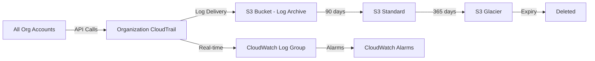

# aws-landing-zone

Terraform modules for building a production-ready AWS multi-account landing zone with Organizations, Service Control Policies, IAM Identity Center (SSO), centralized CloudTrail logging, and automated account vending.

## Architecture

```mermaid
graph TB
    subgraph "Management Account"
        ORG[AWS Organization]
        CT[Organization CloudTrail]
        SSO_INST[IAM Identity Center]
    end

    ORG --> ROOT[Root]
    ROOT --> SEC_OU[Security OU]
    ROOT --> INFRA_OU[Infrastructure OU]
    ROOT --> WORK_OU[Workloads OU]
    ROOT --> SAND_OU[Sandbox OU]

    SEC_OU --> LOG_ACC[Log Archive Account]
    SEC_OU --> AUDIT_ACC[Audit Account]
    INFRA_OU --> NET_ACC[Network Hub Account]
    INFRA_OU --> SHARED_ACC[Shared Services Account]
    WORK_OU --> PROD_ACC[Production Accounts]
    WORK_OU --> STAGE_ACC[Staging Accounts]
    SAND_OU --> DEV_ACC[Developer Accounts]

    subgraph "Service Control Policies"
        SCP1[Deny Root Account Usage]
        SCP2[Deny Leave Organization]
        SCP3[Restrict Regions]
        SCP4[Require Encryption]
    end

    SCP1 -.-> SEC_OU
    SCP1 -.-> INFRA_OU
    SCP1 -.-> WORK_OU
    SCP1 -.-> SAND_OU
    SCP2 -.-> SEC_OU
    SCP2 -.-> INFRA_OU
    SCP2 -.-> WORK_OU
    SCP2 -.-> SAND_OU
    SCP3 -.-> INFRA_OU
    SCP3 -.-> WORK_OU
    SCP3 -.-> SAND_OU
    SCP4 -.-> SEC_OU
    SCP4 -.-> INFRA_OU
    SCP4 -.-> WORK_OU
    SCP4 -.-> SAND_OU

    subgraph "Centralized Logging"
        S3[Encrypted S3 Bucket]
        CW[CloudWatch Log Group]
        KMS[KMS Encryption Key]
    end

    CT --> S3
    CT --> CW
    KMS --> S3
    KMS --> CW

    subgraph "Permission Sets"
        PS1[AdministratorAccess]
        PS2[PowerUserAccess]
        PS3[ReadOnlyAccess]
        PS4[SecurityAudit]
    end

    SSO_INST --> PS1
    SSO_INST --> PS2
    SSO_INST --> PS3
    SSO_INST --> PS4
```



### Log Flow



## Modules

| Module | Description | Key Resources |
|--------|-------------|---------------|
| [`organizations`](modules/organizations/) | AWS Organization with multi-OU hierarchy and service integrations | Organization, 4 OUs, service access principals |
| [`scp`](modules/scp/) | Service Control Policies with conditional guardrails | 4 SCPs (root deny, region restrict, encryption, org membership) |
| [`sso`](modules/sso/) | IAM Identity Center with permission sets and group assignments | Permission sets, identity groups, account assignments |
| [`logging`](modules/logging/) | Organization-wide CloudTrail with encrypted S3 and CloudWatch | CloudTrail, S3 bucket, KMS key, CloudWatch log group |
| [`account-vending`](modules/account-vending/) | Automated account creation with baseline Config and GuardDuty | AWS accounts, Config recorders, tagging |

## Prerequisites

- Terraform >= 1.5
- AWS CLI v2 configured with management account credentials
- An AWS account designated as the management (root) account
- AWS Organizations enabled with `ALL` features
- IAM Identity Center enabled in the management account

## Quick Start

```bash
# Clone the repo
git clone https://github.com/shivajichaprana/aws-landing-zone.git
cd aws-landing-zone

# Review and customize the complete example
cd examples/complete
cp terraform.tfvars.example terraform.tfvars
# Edit terraform.tfvars with your configuration

# Initialize and plan
terraform init
terraform plan

# Apply (review the plan carefully first)
terraform apply
```

### Deployment Order

The modules must be applied in sequence due to dependencies:

1. **Organizations** — creates the org structure and OUs
2. **SCP** — attaches guardrails to OUs (requires OU IDs from step 1)
3. **SSO** — configures permission sets and groups (requires org to be set up)
4. **Logging** — creates centralized logging (requires org ID)
5. **Account Vending** — provisions accounts into OUs (requires all of the above)

The [complete example](examples/complete/) wires all modules together with proper `depends_on` declarations.

## Project Structure

```
aws-landing-zone/
├── modules/
│   ├── organizations/       # AWS Organization + OU hierarchy
│   │   ├── main.tf
│   │   ├── variables.tf
│   │   ├── outputs.tf
│   │   ├── versions.tf
│   │   └── README.md
│   ├── scp/                 # Service Control Policies
│   │   ├── main.tf
│   │   ├── variables.tf
│   │   ├── outputs.tf
│   │   ├── versions.tf
│   │   └── README.md
│   ├── sso/                 # IAM Identity Center (SSO)
│   │   ├── main.tf
│   │   ├── variables.tf
│   │   ├── outputs.tf
│   │   ├── versions.tf
│   │   └── README.md
│   ├── logging/             # CloudTrail + centralized logs
│   │   ├── main.tf
│   │   ├── variables.tf
│   │   ├── outputs.tf
│   │   ├── versions.tf
│   │   └── README.md
│   └── account-vending/     # Automated account provisioning
│       ├── main.tf
│       ├── variables.tf
│       ├── outputs.tf
│       ├── versions.tf
│       └── README.md
├── examples/
│   └── complete/            # Full landing zone example
│       ├── main.tf
│       ├── variables.tf
│       └── outputs.tf
├── tests/                   # Terraform native tests
│   ├── organizations_test.tftest.hcl
│   ├── scp_test.tftest.hcl
│   └── account_vending_test.tftest.hcl
├── .github/
│   └── workflows/
│       └── terraform-ci.yml   # CI: fmt, validate, lint, test
├── docs/
│   └── design-decisions.md  # Architecture Decision Records
├── CONTRIBUTING.md
├── Makefile
├── LICENSE
└── README.md
```

## Development

```bash
# Format all Terraform files
make fmt

# Validate all modules
make validate

# Run linter
make lint

# Run tests
make test

# Run everything
make all
```

See the [Makefile](Makefile) for all available targets.

## Contributing

See [CONTRIBUTING.md](CONTRIBUTING.md) for development guidelines, coding standards, and the pull request process.

## Design Decisions

See [docs/design-decisions.md](docs/design-decisions.md) for architecture decision records explaining why we chose Terraform over AWS Control Tower, the SCP attachment strategy, and other key decisions.

## License

MIT License — see [LICENSE](LICENSE) for details.
